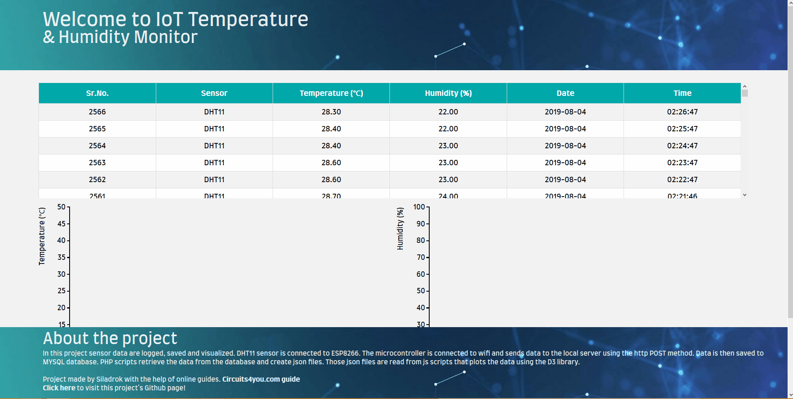

# IoT Temperature & Humidity Monitor
In this project sensor data are logged, saved and visualized. DHT11 sensor is connected to ESP8266. The microcontroller is connected to wifi and sends data to the local server using the http POST method. Data is then saved to MYSQL database. PHP scripts retrieve the data from the database and create json files. Those json files are read from js scripts that plots the data using the D3 library.

