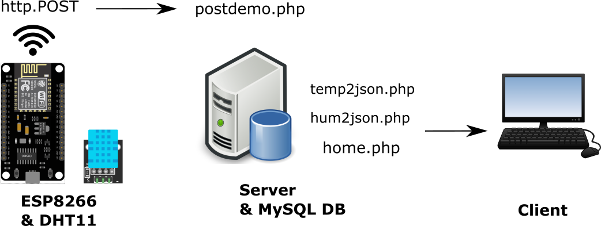

# IoT Temperature & Humidity Monitor

In this project sensor data are logged, saved to a database and visualized. 

We are using a temperature and humidity sensor to collect data. The ESP8266 connects to the local network through wifi and sends data to the local server. Data is stored to a database. The client can visit the localhost homepage and view all the data logged and measurements from the last 24 Hours.

Part of this project was based on the following guide: 

https://circuits4you.com/2018/03/10/esp8266-nodemcu-post-request-data-to-website/

# How it works:

**PostData.ino**  Reads sensor data makes post requests

**install.php:**  Installs the database (needs to run once)

**postdemo.php**: Handles the post request made by the ESP module

**home.php:**     Is the home page

**temp2json:**    Takes data from database and encodes them to json

**hum2json:**     Takes data from database and encodes them to json 

**temp_script.js:**  Reads the json data and plots the temp bar graph

**hum_script.js:**   Reads the json data and plots the hum bar graph

DHT11 sensor is connected to ESP8266. The microcontroller is connected to wifi and sends data to the local server using the http POST method. Data is then saved to MySQL database. PHP scripts retrieve the data from the database and create json files. Those json files are read from js scripts that plot the data using the D3 library.

# Steps to run this project:

1. Setup a server with Apache, PHP, and MySQL, I used wamp server: http://www.wampserver.com/en/
2. Run install.php (Need to make changes to servername, username, password to each php file!)
3. Connect the sensor to the ESP wifi module

4. Modify the code with your ssid, password and post request destination (should be the localhost/postdemo.php)
5. Upload code with the Arduino IDE

If you are getting errors while trying to post data, disable your firewall or make an exception!

